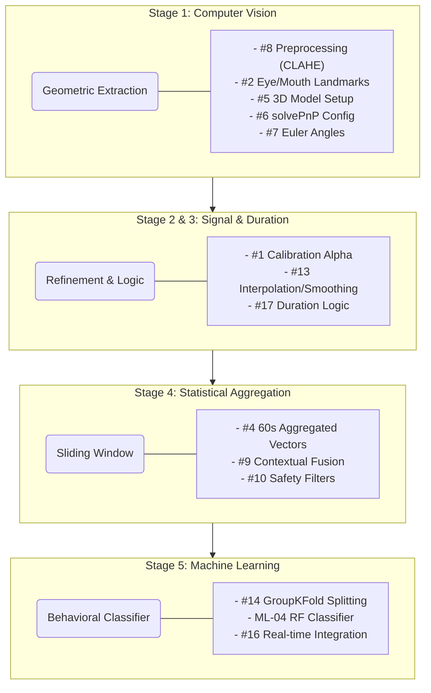

# 📊 Lightweight-DMS Live Dashboard

This is the interactive progress tracker. Members should check the boxes as they complete steps.

---

## 🟢 Phase 1: Computer Vision (Vision Specialist)
- [x] **#8: [Stage 1] Preprocessing (CLAHE) & Face Mesh**
- [x] **#2: [Stage 1] Eye & Mouth Landmark Extraction (EAR/MAR)**
- [ ] **#5: [Stage 1] 3D Model Setup & Core Landmarks**
- [ ] **#6: [Stage 1] solvePnP Config & Camera Matrix**
- [ ] **#7: [Stage 1] Euler Angles (Yaw, Pitch, Roll)**

## 🟡 Phase 2: Data Engineering (Feature Engineer)
- [x] **#1: [Stage 2] Calibration Alpha (Dynamic Thresholds)**
- [x] **#13: [Stage 2] Signal Refinement (Interpolation & Smoothing)**
- [ ] **#17: [Stage 3] Duration Logic (Blinks vs. Micro-sleeps)**
- [ ] **#4: [Stage 4] Statistical Aggregation (60s Sliding Window)**
- [ ] **#9: [Stage 4] Contextual Fusion (EAR + Head Pose)**
- [ ] **#10: [Stage 4] Behavioral Safety Filter (Post-processing)**

## 🔵 Phase 3: Machine Learning (ML Lead)
- [ ] **#14: [Stage 5] Participant-Based Data Splitting**
- [ ] **#15: [Stage 5] Dataset Partitioning (Train/Val/Test)**
- [ ] **ML-04: [Stage 5] Train Behavioral Random Forest Classifier**
- [ ] **#16: [DEP-01] Real-time Pipeline Integration**

---

## 🛠 Management Notes
- **Verification**: Only check a box after the PR has been merged into `main`.
- **Reference**: Consult [METHODOLOGY.md](METHODOLOGY.md) for technical formulas.
