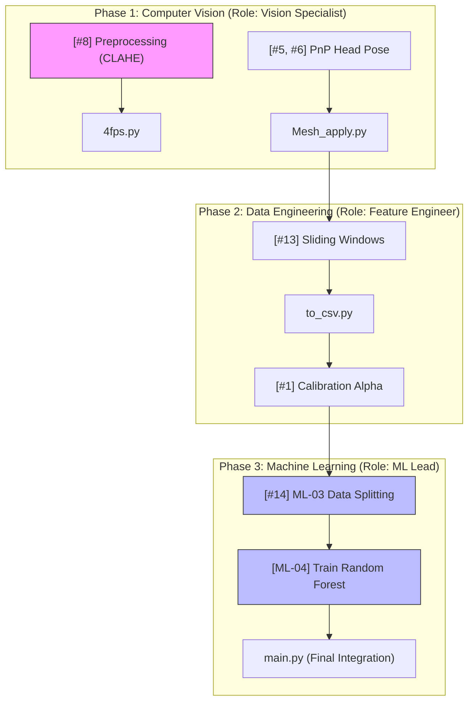

# Master Project Management & Pipeline Plan

This document outlines the workflow for managing group contributions, merging code via GitHub, and ensuring the correct execution sequence of the project pipeline.

## 1. Task Management (Kanban Board)

We use **GitHub Projects** as our central Kanban board. 

*   **Board Link**: [Lightweight DMS Board](https://github.com/users/thanhhuyvan/projects/2)
*   **Workflow**:
    1.  **Pick a Task**: Go to the board and select an issue from the **Todo** column.
    2.  **Assign Yourself**: Click on the issue and set yourself as the **Assignee**. This tells the team you are working on it.
    3.  **Update Status**: Drag your card to **In Progress** while coding.
    4.  **Completion**: Once your PR is merged, the card will automatically move to **Done**.

---

## 2. Visual Task Roadmap & Role Assignments

To ensure everyone knows their domain, we follow a **3-Phase Specialized Workflow**.

### A. The Pipeline Map (Mermaid)
This diagram maps current tasks to the execution sequence.


### B. The 3-Person Role Matrix
| Role | Responsibility | Primary Files | Active Tasks |
| :--- | :--- | :--- | :--- |
| **Vision Specialist** | Frame quality & Landmark accuracy | `4fps.py`, `Mesh_apply.py` | #8, #5, #6 |
| **Feature Engineer** | Signal smoothing & Time-series | `to_csv.py`, `calibration.py` | #13, #1 |
| **ML Lead** | Model Training & Evaluation | `train_baseline.py`, `eye_state.py` | #14, ML-04 |

---

## 3. Git Workflow (Manager's Guide)

To protect the core dataset and maintain code quality, follow this branching and merging strategy:

### Branching Strategy
- **`main` Branch**: **STRICTLY PROTECTED.** Do not push directly to `main`.
- **Feature Branches**: Every task must be on a separate branch (e.g., `feature/ML-02-sliding-windows`).

### PR Review & Merging Process
1.  **Submission**: Submit a Pull Request (PR) from your feature branch to `main`.
2.  **Linking**: Include the issue number in your PR description (e.g., "Closes #13") to auto-sync the Kanban board.
3.  **Local Verification**: Before merging, the Manager (or reviewer) must test locally:
    ```powershell
    git fetch origin
    git checkout feature/your-branch-name
    python main.py  # Verify the pipeline still runs correctly
    ```
4.  **Architectural Audit**: Ensure the new code follows `pathlib` standards and uses `src/core_config.py`.

---

## 3. Pipeline Sequencing (Master Orchestration)

The `main.py` script is the single source of truth for execution. **All new scripts must be added to the `steps` list in `main.py`.**

**Current Sequence:**
1. `Frame_exrtaction/4fps.py` (Preprocessing & CLAHE)
2. `frame/Mesh_apply.py` (Face Mesh & Landmark Generation)
3. `to_csv.py` (Feature Extraction & Smoothing)
4. `src/analyze_failures.py` (Failure Analysis Report)

---

## 4. Data Integrity & Quality Standards

- **Path Safety**: Use `PROJECT_ROOT` from `core_config.py` for all file paths.
- **Failure Handling**: Our current face detection failure rate is **7.88%**. 
    - `participant1` is a known outlier (~31% failure). 
    - When writing ML or Analysis scripts, ensure you handle `face_detected == False` rows properly (e.g., via interpolation or exclusion).
- **Read-Only Data**: Treat `landmarks_full.csv` as read-only. Save all new features into `features_summary.csv` or new files.

---

## 5. Contributor Checklist
- [ ] Is your task assigned to you on the GitHub Project board?
- [ ] Does your branch name follow the `feature/ID-description` format?
- [ ] Did you add your script to the `steps` in `main.py`?
- [ ] Did you update `requirements.txt` if you added new libraries?
- [ ] Does your code use `logging` instead of `print()`?
