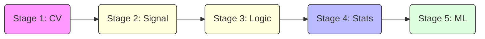

# Master Project Plan: Behavioral Drowsiness Detection

This document defines the scientific framework, architectural standards, and execution roadmap for the Lightweight-DMS project.

---

## 1. System Objectives
The primary goal is to build a robust, participant-independent monitoring system that distinguishes between:
*   **Biological Blinks**: Normal, high-frequency physical movements.
*   **Physiological Drowsiness**: Sustained behavioral patterns indicative of fatigue.

---

## 2. Modular Architecture (5-Stage Pipeline)

Our architecture is designed as a series of specialized layers to ensure signal purity and classification accuracy.

### A. Pipeline Visualization

```mermaid
graph LR
    S1(Stage 1: CV) --> S2(Stage 2: Signal)
    S2 --> S3(Stage 3: Logic)
    S3 --> S4(Stage 4: Stats)
    S4 --> S5(Stage 5: ML)

    style S1 fill:#f9f,stroke:#333
    style S2 fill:#ffd,stroke:#333
    style S3 fill:#ffd,stroke:#333
    style S4 fill:#bbf,stroke:#333
    style S5 fill:#dfd,stroke:#333
```

### B. Functional Breakdown
1.  **Stage 1: Computer Vision**: Landmark localization and pixel-to-coordinate mapping.
2.  **Stage 2: Signal Integrity**: Noise removal, interpolation of face-loss, and dynamic baseline calibration.
3.  **Stage 3: Duration Logic**: Temporal segmentation of eye states (e.g., $duration < 0.3s = blink$).
4.  **Stage 4: Statistical Aggregation**: Compiling 60-second behavioral vectors (PERCLOS, Variance, Frequency).
5.  **Stage 5: Machine Learning**: High-level classification of the driver's physiological state (Alert/Drowsy/Sleeping).

---

## 3. Data Integrity & Validation Standards

To ensure scientific rigor, all contributions must adhere to these standards:

### A. Protective Layers (Fail-Safes)
*   **Signal Integrity**: No training on "broken" windows; interpolation is mandatory for gaps < 1s.
*   **Contextual Fusion**: EAR closure must be cross-verified with Head Pose "nodding" to increase alert confidence.
*   **Temporal Persistence**: Predictions are based on a 60s window to eliminate "flickering" false alarms.

### B. Machine Learning Rigor
*   **Zero Leakage**: Use `GroupKFold` by `participant_id`. Data from one face must never be in both Train and Test.
*   **Target Clarity**: ML targets behavioral video-labels (0, 5, 10), NOT deterministic frame-states.

---

## 4. Operational Roadmap (Sequencing)

The pipeline is orchestrated via `main.py`. New modules must be registered in the following order:

1.  `4fps.py` -> `Mesh_apply.py` (Geometric Data)
2.  `to_csv.py` -> `calibration.py` (Signal Cleansing)
3.  `duration_logic.py` (Behavioral Segmentation)
4.  `stats_aggregation.py` (Window Aggregation)
5.  `train_behavioral.py` (Physiological Classification)

---

## 5. Contributor Standards
*   **Logic over Code**: Prioritize the "Why" (Methodology) before the "How" (Implementation).
*   **Git Integrity**: Feature branches only. 100% path safety using `core_config.py`.
*   **Logging**: All scripts must track execution duration and data loss metrics.
