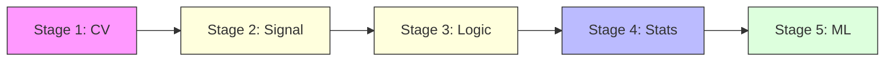

# Master Project Plan: Behavioral Drowsiness Detection System

## 1. Executive Summary
This project implements a multi-stage monitoring pipeline designed to detect physiological drowsiness using non-intrusive facial analysis. The system differentiates between normal biological behaviors (blinks) and pathological fatigue (micro-sleeps) through temporal statistical aggregation.

---

## 2. Scientific Framework & Modular Architecture

### 2.1. System Workflow (5-Stage Pipeline)
The architecture follows a strict sequential flow to ensure signal purity and behavioral significance.

```mermaid
graph LR
    S1[Stage 1: CV] --> S2[Stage 2: Signal]
    S2 --> S3[Stage 3: Logic]
    S3 --> S4[Stage 4: Stats]
    S4 --> S5[Stage 5: ML]

    style S1 fill:#f9f,stroke:#333
    style S2 fill:#ffd,stroke:#333
    style S3 fill:#ffd,stroke:#333
    style S4 fill:#bbf,stroke:#333
    style S5 fill:#dfd,stroke:#333
```

### 2.2. Functional Layer Descriptions
1.  **Stage 1: Computer Vision (Localization)**: Mapping facial pixels to a 3D coordinate system (Face Mesh).
2.  **Stage 2: Signal Integrity (Conditioning)**: Removing noise, interpolating missing frames, and personalizing thresholds.
3.  **Stage 3: Duration Logic (Segmentation)**: Classification of eye closure events based on temporal length ($T$).
4.  **Stage 4: Statistical Aggregation (Context)**: Generating a behavioral vector over a 60-second sliding window.
5.  **Stage 5: Machine Learning (Inference)**: Final classification of the physiological state (Alert vs. Drowsy).

---

## 3. Rigorous Validation & Data Standards

### 3.1. Protective Layers (System Guardrails)
*   **Layer 1 (Signal)**: Polynomial interpolation (Order 2) for face-loss compensation.
*   **Layer 2 (Duration)**: Pre-filtering blinks ($T < 0.3s$) to reduce ML noise.
*   **Layer 3 (Context)**: Cross-verifying ocular closure (EAR) with vestibular changes (Head Pose).
*   **Layer 4 (Persistence)**: Prediction smoothing over 60s windows to prevent alert flickering.

### 3.2. Machine Learning Protocols
*   **Group Independence**: Mandatory use of `GroupKFold` to prevent participant leakage.
*   **Target Hierarchy**: ML targets behavioral labels (0, 5, 10), while deterministic states (eye_state) serve as input features.

---

## 4. Execution Roadmap (Sequencing)

| Stage | Module | Primary Output |
| :--- | :--- | :--- |
| **1** | `4fps.py` | CLAHE Enhanced Frames |
| **1** | `Mesh_apply.py` | 3D Landmarks & Raw Ratios |
| **2** | `to_csv.py` | Smoothed/Interpolated Signals |
| **2** | `calibration.py` | Dynamic $\alpha$ Thresholds |
| **3** | `duration_logic.py` | Micro-sleep & Blink Count |
| **4** | `stats_aggregation.py` | 60s Behavioral Vectors |
| **5** | `train_behavioral.py` | Trained Random Forest Model |

---

## 5. Engineering Standards
*   **Infrastructure**: All paths must resolve via `core_config.py`.
*   **Collaboration**: Branch-based workflow (`feature/ID-desc`).
*   **Verification**: 100% logging of data loss and execution latency.
