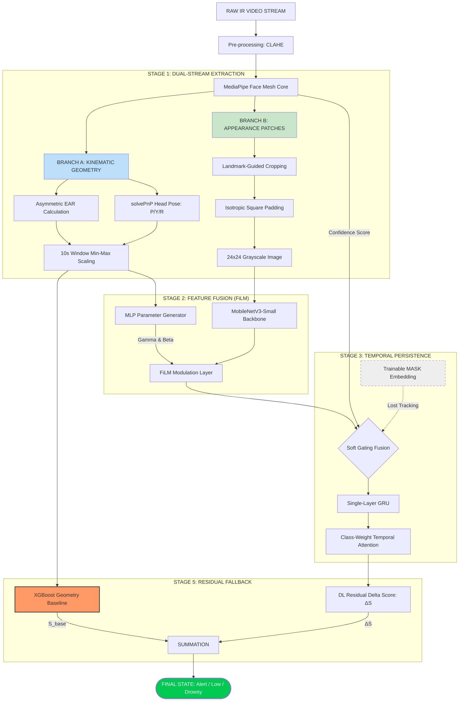

# Technical Specification: Robust Hybrid Framework with Residual Fallback

## 0. System Architecture

## 1. Core Architecture Philosophy
The system is built on a **"Safety-First"** principle. We use deterministic 3D geometry as a reliable baseline and Deep Learning as a high-precision refinement layer. The goal is to maximize **F1-Score** by reducing inter-participant variance.

---

## 2. Detailed Pipeline Stages

### Stage 1: Dual-Stream Feature Extraction
**Developer's Mission:** Prepare high-quality, normalized "food" for the models.

*   **Branch A (Geometric Math):** 
    *   **solvePnP Head Pose:** Use 6 anchors (Nose 1, Chin 152, L-Eye 33, R-Eye 263, L-Mouth 61, R-Mouth 291). *Purpose:* Get actual angles to compensate for head tilts.
    *   **Asymmetry EAR:** $|EAR_{left} - EAR_{right}|$. *Purpose:* Detect one-sided eyelid drooping, a strong sign of fatigue.
    *   **Continuous Min-Max:** For every 10s window, find the max/min EAR and scale values to $[0, 1]$. *Purpose:* A "small eye" driver and a "big eye" driver will look identical to the model.
*   **Branch B (Isotropic Patches):** 
    *   **Square Padding:** If an eye patch is $40 \times 20$, add 10px black padding top/bottom to make it $40 \times 40$. *Purpose:* Prevents the "squashed eye" effect when resizing, which confuses CNNs.

### Stage 2: Feature-Level Modulation (FiLM)
**Developer's Mission:** Allow the "brain" (Math) to tell the "eyes" (CNN) what to look for.

*   **Mechanism:** Use a 2-layer MLP to turn the Geometry Vector (Pose + EAR) into $\gamma$ and $\beta$.
*   **Fusion:** Multiply/Add these values into the MobileNet feature maps.
*   *Why?* If the head is turned (Yaw), the math tells the CNN: "The eye looks smaller because of the angle, don't trigger a false alarm."

### Stage 3: Gated GRU & Temporal Attention
**Developer's Mission:** Handle the "messy reality" of driving (occlusions/lost tracking).

*   **Confidence Gating:** If MediaPipe confidence $< 0.4$, switch input to a [MASK] vector. The GRU will use its "memory" to predict the state for up to 2 seconds.
*   **Class-Weight Attention:** Penalize the model more for missing a "Drowsy" frame than an "Alert" frame. This directly boosts **Recall** and **F1-Score**.

### Stage 4: Contrastive Training (Triplet Loss)
**Developer's Mission:** Force the model to see the "gap" between tired and awake.

*   **Triplet Logic:** (Anchor: Low Vigilant, Positive: Drowsy, Negative: Alert).
*   **Goal:** In the embedding space, "Tired" states must cluster together, far away from "Alert".

### Stage 5: Residual Fallback (The Safety Net)
**Developer's Mission:** Ensure we NEVER perform worse than our current $0.5422$ F1-Score.

*   **Formula:** $Final\_Score = XGBoost(Geometry) + \Delta S(Deep\_Learning)$.
*   **Constraint:** Limit $\Delta S$ to $\pm 0.15$ via a Tanh activation.
*   *Benefit:* If the CNN is blinded by a headlight, $\Delta S$ goes to 0, and the system relies 100% on the stable Math baseline.

---

## 3. Data Flow Summary (For Implementation)
1.  `Input`: 10-15 FPS IR Video.
2.  `Output 1`: 12D Geometry Vector (from solvePnP + EAR + MAR).
3.  `Output 2`: $24 \times 24$ Gray Square Patches (L-Eye, R-Eye, Mouth).
4.  `Output 3`: Final 3-class probability $[P_{alert}, P_{low}, P_{drowsy}]$.
