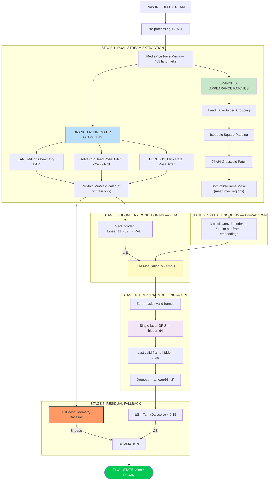

# Technical Specification: Hybrid FiLM + GRU Drowsiness Detection Framework

## 0. System Architecture



---

## 1. Core Architecture Philosophy

The system is built on a **"Safety-First"** principle: deterministic 3D geometry provides a reliable, interpretable baseline while the deep learning component acts as a high-precision refinement layer. The two streams are complementary — when visual patches are corrupted by poor lighting or tracking failure, the geometry signal remains stable, and vice versa.

Three design mandates are enforced throughout the pipeline:

- **Isotropic Rule:** All image patches must be padded to a 1:1 aspect ratio before resizing to prevent aspect-ratio distortion.
- **Min-Max Standard:** Geometry features are scaled using a `MinMaxScaler` fitted exclusively on the training fold of each cross-validation split, applied per-fold at inference time.
- **Residual Fallback:** The deep learning component outputs a bounded correction term $\Delta S$, ensuring the system can never perform below the geometry-only baseline.

---

## 2. Staged Model Development Protocol

The architecture is validated through a **progressive staging protocol** where each stage builds on the previous, and weights are transferred forward:

```
Stage B  →  Stage D  →  Stage E
CNN-only    Late Fusion   FiLM + GRU
             (loads B)    (loads D or B)
```

This ensures that each added component is proven to contribute before committing to the full architecture.

---

## 3. Detailed Pipeline Stages

### Stage 1: Dual-Stream Feature Extraction

**Mission:** Produce two parallel, high-quality feature streams from each 10-second temporal window.

#### Branch A — Kinematic Geometry (11-dim vector)

| Feature | Method | Purpose |
|:---|:---|:---|
| Left EAR, Right EAR, Mean EAR, EAR Std | Landmark ratio | Progressive eyelid drooping |
| Asymmetry EAR | \|EAR_L − EAR_R\| | Unilateral fatigue detection |
| MAR Mean, MAR Max | Landmark ratio | Yawning frequency |
| Pitch, Yaw, Roll Jitter | solvePnP + Rodrigues | Head pose via 6 stable anchors |
| PERCLOS proxy | Blink rate per window | Sustained low-EAR accumulation |

**solvePnP anchors:** Nose tip (1), Chin (152), Left eye outer (33), Right eye outer (263), Left mouth corner (61), Right mouth corner (291).

**Per-fold MinMaxScaler:** Fit on training indices only, applied at `__getitem__` time. This normalizes relative change (the drowsiness signal) independently of absolute anatomical baseline (eye size, face geometry), ensuring cross-participant comparability without leaking held-out participant statistics.

A **Moving Average filter (W = 3)** is applied to landmark coordinates before feature computation to suppress high-frequency tracking jitter.

#### Branch B — Isotropic Appearance Patches

For each valid frame, three regions are extracted: **left eye**, **right eye**, **mouth**.

1. **Landmark-guided bounding box** from extreme landmark coordinates + margin.
2. **Isotropic square padding:** Symmetric black-pixel padding on the shorter axis to enforce a strict 1:1 aspect ratio before resizing. This prevents the "squashed eye" distortion that corrupts CNN spatial filters.
3. **Resize to 24×24 pixels** (bicubic).
4. **Grayscale** — saved as single-channel PNG, loaded as 3-channel stacked tensor for conv compatibility.

**Soft valid-frame mask:** Each frame receives a validity score equal to the mean of its per-region validity flags (0 if patch missing, 1 if present). Using the mean rather than the minimum ensures that a single occluded region (e.g., mouth covered by a hand) does not zero out the entire frame's contribution when the eye patches are clean.

**Training augmentation (applied to training split only):**
- Random horizontal flip (p = 0.5)
- Colour jitter: brightness ±0.3, contrast ±0.3

**CLAHE pre-processing** is applied to each raw frame before landmark extraction to suppress IR glare and illumination volatility inside the vehicle cabin.

---

### Stage B — CNN-Only Spatial Classifier (TinyPatchCNN)

**Mission:** Validate that visual patches carry discriminative signal for drowsiness in isolation, before any fusion.

The `TinyPatchCNN` encoder processes each frame patch independently through three convolutional blocks:

```
Input: (3, 24, 24)
Conv2d(3→16, k=3, pad=1) → BatchNorm → ReLU → MaxPool2d(2)   →  (16, 12, 12)
Conv2d(16→32, k=3, pad=1) → BatchNorm → ReLU → MaxPool2d(2)  →  (32, 6, 6)
Conv2d(32→64, k=3, pad=1) → BatchNorm → ReLU → AdaptiveAvgPool2d(1)  →  (64, 1, 1)
Flatten → Linear(64→64) → ReLU → Dropout
```

The 40-frame embeddings are aggregated by **soft masked average pooling** — valid frames are weighted by their validity score, invalid frames contribute zero.

The pooled vector passes through a linear classifier head.

---

### Stage D — Late Fusion (CNN + Geometry)

**Mission:** Demonstrate that geometry features rescue cross-participant generalization where CNN patches fail.

The Late Fusion model fuses:
- A **64-dim pooled CNN embedding** from the frozen-then-fine-tuned TinyPatchCNN encoder
- A **32-dim geometry projection**: `Linear(11→32) → ReLU → Dropout`

Fusion: `concat[64 + 32] → Linear(96→64) → ReLU → Dropout → Linear(64→2)`

**CNN warm-up freeze:** The CNN encoder is loaded from Stage B checkpoints and frozen for the first `N` epochs so the newly initialized geometry and fusion branches can stabilize. The optimizer uses **parameter groups** (CNN group at `lr=0`, other groups at full `lr`) so that when the CNN unfreezes, the learning rate is updated in-place without discarding accumulated Adam momentum. Patience and best-score counters are reset at the unfreeze epoch to give joint fine-tuning a clean chance.

---

### Stage E — FiLM + GRU (Primary Architecture)

**Mission:** Add temporal context and per-participant geometry conditioning to overcome the stateless limitation of Late Fusion.

#### FiLM Modulation Layer

The geometry conditioning vector is passed through a two-layer GeoEncoder (`Linear(11→32) → ReLU`) to produce a 32-dim conditioning signal. This signal is then decoded into per-channel affine parameters:

$$\tilde{z}_t = \gamma \odot z_t + \beta, \quad (\gamma, \beta) = \text{Linear}(\mathbf{g})$$

where **g** is the per-fold scaled geometry vector and $z_t$ is the frame-level CNN embedding. The FiLM layer is **identity-initialized** ($\gamma = 1$, $\beta = 0$) via zero-weight / ones-bias init, so early training epochs begin from the CNN-only baseline and the modulation gradually activates as it learns useful conditioning.

*Why FiLM beats simple concatenation:* Concatenation adds geometry after the CNN has already committed to its representation. FiLM re-scales and shifts the CNN's internal activations *before* they are consumed by the GRU, so the temporal model sees geometry-adapted visual features throughout.

#### GRU Temporal Model

The sequence of FiLM-modulated embeddings $(B, T, 64)$ is passed through a single-layer GRU with 64 hidden units:

- Invalid frames (tracking failures) are **zeroed out** before entering the GRU, preventing corrupted frames from contaminating the hidden state.
- The hidden state at the **last valid frame** (not the final sequence position) is extracted for classification, using a per-sequence index derived from the soft valid-frame mask.

```
patches (B, T, 3, 24, 24) → FrameCNNEncoder → frame_emb (B, T, 64)
geo    (B, 11)             → GeoEncoder      → geo_cond  (B, 32)
FiLM(frame_emb, geo_cond)                   → mod_emb   (B, T, 64)
mod_emb × valid_mask → GRU(64 hidden) → h[last_valid] (B, 64)
Dropout → Linear(64→2) → logits
```

The same warm-up freeze strategy as Stage D applies: CNN encoder starts frozen, parameters are organized into groups, and patience resets on unfreeze.

---

### Stage 5 — Residual Fallback (Safety Net)

**Mission:** Ensure the system never performs below the geometry-only baseline under any deployment condition.

$$S_{\text{final}} = S_{\text{base}} + \Delta S, \quad \Delta S = \tanh\!\left(f_{\text{DL}}(x)\right) \times 0.15$$

- $S_{\text{base}}$: XGBoost prediction from geometry features (the deterministic fallback).
- $\Delta S$: bounded deep learning correction, capped at ±0.15 by the Tanh activation.

If the CNN is blinded (headlight glare, camera occlusion), $\Delta S \to 0$ and the system degrades gracefully to geometry-only prediction.

---

## 4. Cross-Validation Protocol

All models are evaluated under **5-fold GroupKFold**, where groups are defined at the participant level. This guarantees no frames from a held-out participant appear in training — preventing participant-identity leakage.

- `MinMaxScaler` is fit exclusively on training fold indices and applied to the held-out fold at inference time.
- CNN checkpoints are saved per-fold so that Stage D and Stage E load the correct fold-aligned pre-trained weights.
- All window sampling (balanced class sub-sampling via `max_windows`) uses the **same random seed** across stages to ensure fold assignments are consistent.

**Class weighting:** `CrossEntropyLoss` uses per-fold class weights (`N_total / N_class`, normalized) to handle class imbalance without oversampling.

---

## 5. Data Flow Summary

```
Input:      10–15 FPS IR Video
              │
              ▼ CLAHE enhancement
              ▼ MediaPipe Face Mesh (468 landmarks)
              │
       ┌──────┴──────┐
       ▼             ▼
  Branch A        Branch B
  11D Geometry    3 × (24×24) Patches
  (per window)    (per frame, T=40)
       │             │
  MinMaxScaler    Soft valid mask
  (per fold)      + Augmentation
       │             │
       └──────┬──────┘
              ▼
         TinyPatchCNN Encoder → 64-dim frame embeddings
              ▼
         FiLM(geo_cond) → geometry-modulated embeddings
              ▼
         GRU → last-valid hidden state
              ▼
         Classifier Head → logits
              ▼
         + XGBoost baseline (Residual Fallback)
              ▼
         Final: Alert / Drowsy
```
