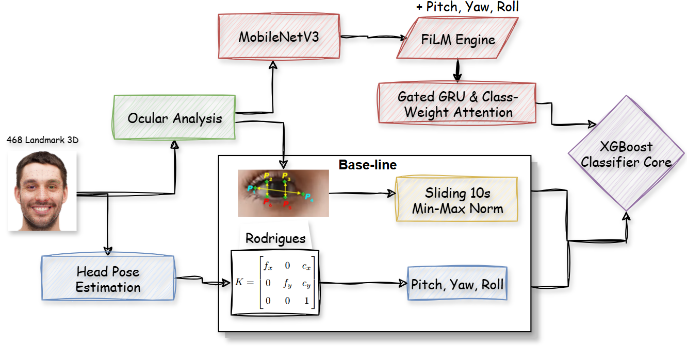

# Lightweight-DMS: Vision-Based Driver Drowsiness Detection

A lightweight, CPU-deployable Driver Monitoring System using FiLM-conditioned GRU with temporal attention. Achieves **macro F1 = 0.8269** under strict Leave-One-Participant-Out cross-validation.


---

## Demo

Run the real-time webcam demo with live signal graphs:

```bash
python webcam_live_fps.py --demo --model models/film_gru_fold3.pth
```

Controls:
| Key | Action |
|-----|--------|
| `d` | Toggle live graph panel (EAR / Drowsy Prob / PERCLOS) |
| `m` | Toggle face mesh overlay |
| `i` | Toggle eye/mouth patch insets |
| `f` | Toggle latency profiler |
| `r` | Recalibrate EAR threshold |
| `c` | Toggle CLAHE preprocessing |
| `q` | Quit |

---

## Quick Start

**Requirements:**
```bash
pip install torch torchvision mediapipe opencv-python numpy pandas scikit-learn joblib
```

**Run webcam demo:**
```bash
python webcam_live_fps.py --model models/film_gru_fold3.pth --demo
```

**Run on a video file:**
```bash
python docker/predict.py --input video.mp4 --output predictions.csv
```

---

## Results

**SOTA target: macro F1 > 0.80 ✅ Achieved**

### Ablation Study (5-fold LOPO-CV)

| Model | Mean F1 | Std | Component |
|---|---|---|---|
| XGBoost (Geometry Only) | 0.490 | 0.031 | Behavioral geometry baseline |
| CNN Only (TinyPatchCNN) | 0.742 | 0.263 | Visual patches |
| Late Fusion (CNN + Geo) | 0.776 | 0.264 | Static multi-modal fusion |
| Concat+GRU (No FiLM) | 0.810 | 0.180 | Temporal modeling |
| **FiLM+GRU+Attention** | **0.827** | **0.144** | Geometry conditioning + attention |

### Per-Fold Breakdown (Best Run)

| Held-out | F1 | Drowsy Recall | Notes |
|---|---|---|---|
| Participant 2 | 0.872 | 1.000 | Fixed by attention + confidence decay |
| Participant 4 | 0.923 | 0.969 | Strong |
| Participant 3 | 0.981 | 0.997 | Near-perfect |
| Participant 5 | 0.792 | 0.610 | Data diversity issue (N=5 limitation) |
| Participant 6 | 0.722 | 1.000 | Behavioral inversion documented |
| **Mean** | **0.827** | **0.893** | |

---

## Architecture



**Safety net:** Residual fallback keeps DL contribution bounded:
$$S_{\text{final}} = S_{\text{XGBoost}} + \tanh(S_{\text{GRU}}) \times 0.15$$

**Model specs:**
- Parameters: ~9,347
- Checkpoint size: 268 KB
- Inference: < 10 ms per window on CPU
- Throughput: ~30 FPS

---

## Dataset

6 participants recorded under three conditions (alert / mild / drowsy).
- 5 participants used after quality audit (participant1 excluded: 53.8% mesh failure rate)
- 5,946 usable windows after `min_valid_rate = 0.80` filter
- Evaluation: 5-fold Leave-One-Participant-Out CV (strict, no leakage)
